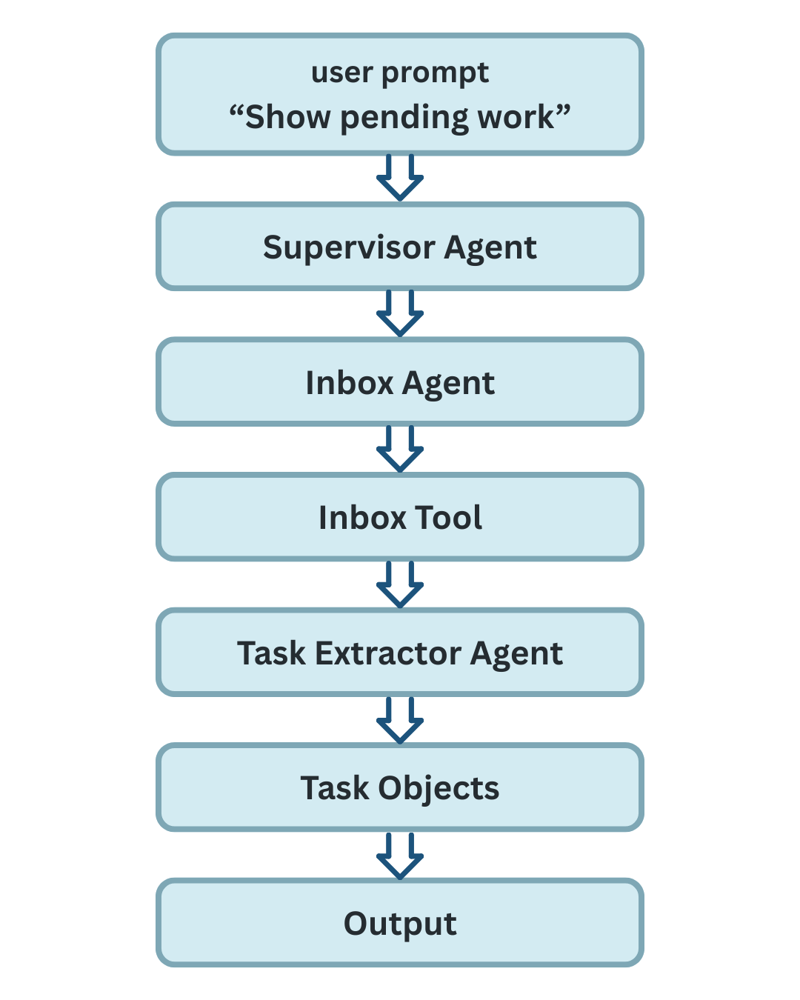
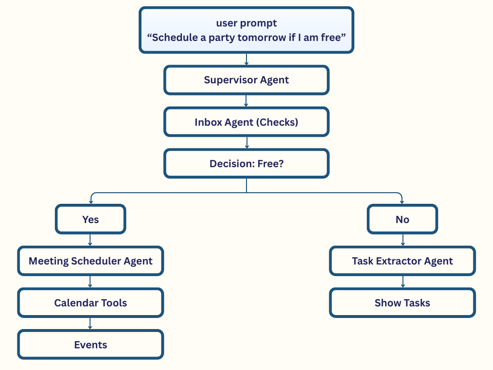
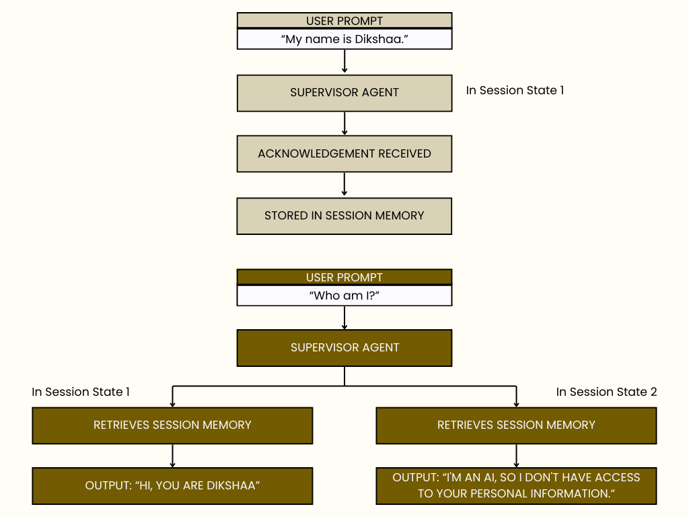

# Schedulify — AI Concierge for Smart Workflow Automation

**Schedulify** is an experimental AI-powered workflow assistant designed to automate everyday professional tasks such as email summarization, task extraction, reminders, and meeting scheduling.

---

## About the Project

Instead of functioning as a single chatbot, Schedulify is built as a **multi-agent system**, where each agent handles a specific responsibility. Together, these agents collaborate to simulate the behavior of a smart personal assistant that can understand context, perform multi-step reasoning, and manage routine workflows with minimal user input.

This project focuses on **agent orchestration, reasoning-based automation, and modular system design**, making it a strong foundation for future real-world integrations.

---

## What Schedulify Does

Schedulify helps reduce manual effort by automating common workflow tasks:

* 📩 **Summarizes inbox messages**
* 📝 **Extracts actionable tasks** from unstructured text
* ⏰ **Detects deadlines** and creates reminders
* 📅 **Schedules meetings** with conflict-aware logic
* 🧠 **Maintains context** across multi-step interactions

The goal is to explore how **agentic AI systems** can move beyond simple responses and actively manage workflows.

---

## System Overview

Schedulify uses a **multi-agent architecture**, where each agent is specialized for a specific task. A central **Supervisor Agent** controls the flow and decides which agents to activate based on user intent.

### Core Agents

| Agent                     | Responsibility                                  |
| :------------------------ | :---------------------------------------------- |
| **Supervisor Agent**      | Orchestrates agent execution and workflow flow  |
| **Summarization Agent**   | Condenses long email threads                    |
| **Task Extraction Agent** | Converts text into structured to-do items       |
| **Reminder Agent**        | Identifies deadlines and schedules reminders    |
| **Scheduling Agent**      | Checks availability and manages calendar events |

> **Note:** Agents may run independently or sequentially, depending on the request.

---

## Workflow Architecture

Schedulify follows a structured execution pipeline:

1. **Intent Analysis** – User request is analyzed for intent
2. **Selection** – Supervisor Agent selects the relevant agent(s)
3. **Execution** – Agents execute actions using attached tools
4. **Memory** – Session memory preserves context across steps

This design ensures smooth execution of **multi-step workflows** without requiring repeated user input.

---

## Tech Stack

* **Language:** Python
* **AI Framework:** OpenAI Agent Framework
* **Architecture:** Multi-Agent, Modular Design
* **Session Management:** In-memory session state

### **Data Stores (Simulated)**

* Inbox
* Calendar
* Reminders
* Logs

*External integrations are currently simulated using dummy stores to keep the project safe and self-contained.*

---

## Workflow Diagrams & Images

---

## Current Status

* ✅ Multi-agent execution implemented
* ✅ Context preserved across steps
* ✅ Inbox, task, reminder, and scheduling logic working
* ⚠️ Uses simulated data (no real API connections yet)

---

## Future Improvements

* Integration with real Email & Calendar APIs (Gmail / Outlook / Google Calendar)
* Persistent long-term memory
* Better task prioritization
* Team-based scheduling support
* Voice-based interaction
* Dashboard UI for monitoring workflows

---
